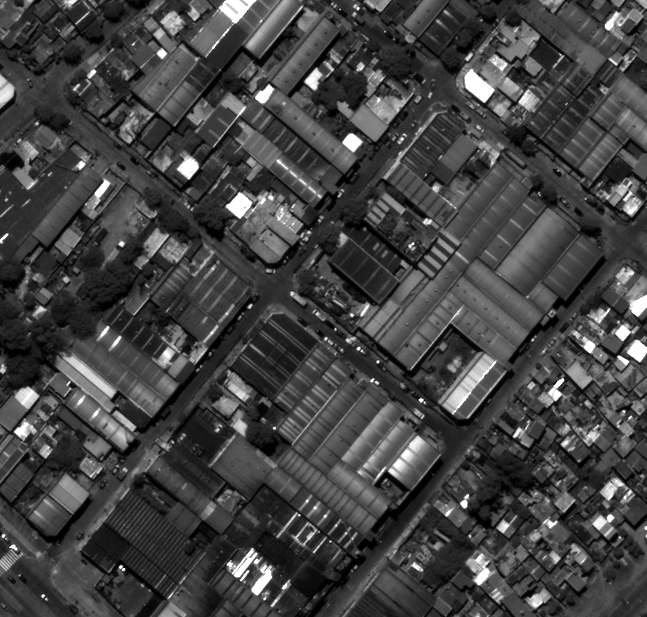
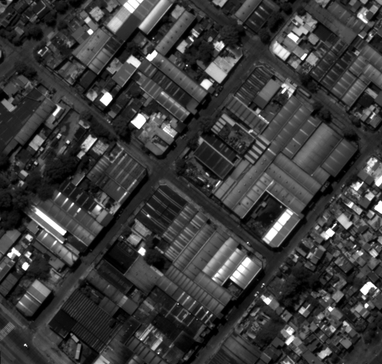
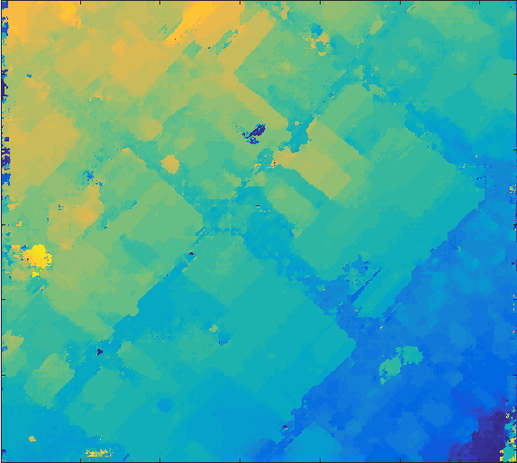
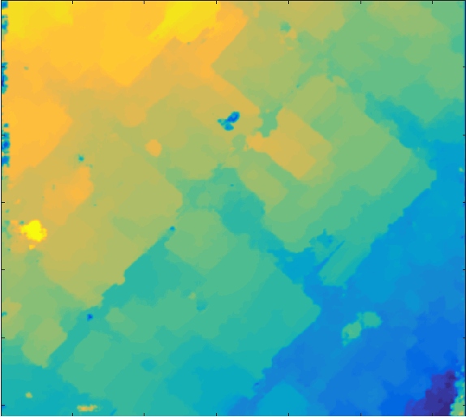
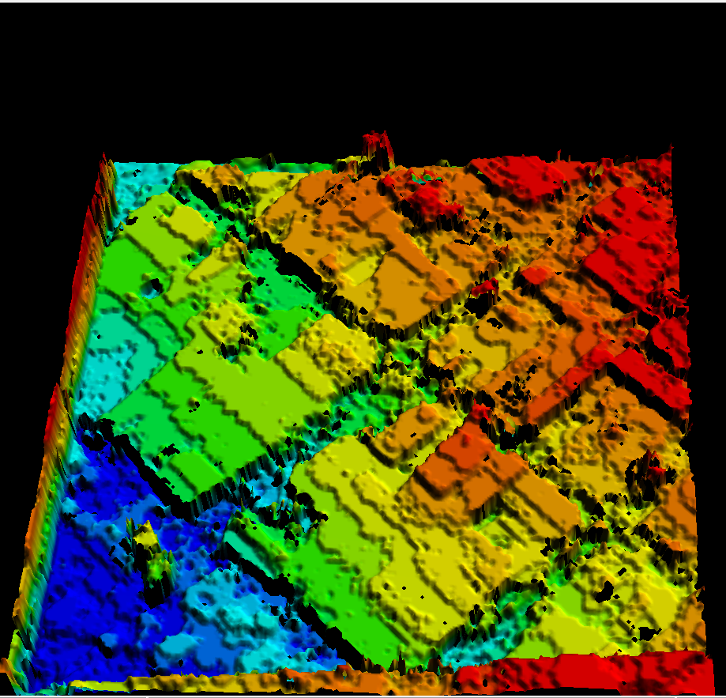
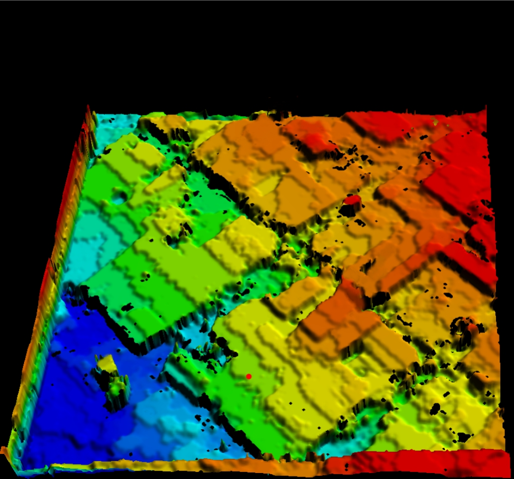

# HS-SMR: Stereo Matching Refinement with Heterogeneous Smoothness for Satellite Image 3D Reconstruction

This project implements an unsupervised three-stage optimization framework for disparity map refinement, tailored to the characteristics of high-resolution satellite imagery and urban 3D reconstruction tasks. By combining region-based MRF modeling with heterogeneity-aware energy formulation and iterative edge-preserving filtering, this method improves the quality of disparity maps generated by traditional stereo matching algorithms.

In addition, the refined disparity maps can be integrated into the **s2p pipeline** to generate high-quality **DSM (Digital Surface Model)** .

---

## 🚀 Key Features

### 🧩 Step 1: Superpixel-Guided MRF Graph Construction
**Function:** `buildMRFGraph(D, IL, numSuperpixels)`
- Performs LSC superpixel segmentation on the left image `IL`.
- Builds an MRF graph with each superpixel as a node.
- Extracts mean intensity, disparity, centroid, and local gradient for each node.
- Generates a 4-neighbor adjacency matrix between superpixels.
- Creates an **edge-aware mask** to guide adaptive smoothness in later stages.

---

### 🧩 Step 2: Region-Aware Energy Function
**Function:** `energyAndGradient(D, IL, IR, lambda_matrix)`
- Defines a **heterogeneity-aware energy function** with:
  - **Data term:** Enforces stereo correspondence between left & right images.
  - **Smoothness term:** Promotes intra-region consistency with adaptive weights.
- Outputs the total energy `E` and its gradient w.r.t disparity.

---

### 🧩 Step 3: Gradient-Filter Iterative Optimization
**Function:** `optimizeDisparity(Efun, D_init, IL, IR, edge_mask)`
- Minimizes energy via gradient descent with line search.
- Applies bilateral filtering after each update to **preserve edges**.
- Stops when convergence criteria are met (gradient norm, step decay, or max iterations).

---

### 🌍 Step 4: DSM Reconstruction (via `s2p.py`)
Once the optimized disparity map `D_opt` is obtained, it can be converted into **3D geometry**:

1. **Disparity → Height map**  
   Using RPC sensor models, each disparity value is back-projected into 3D space to estimate ground elevation.

2. **Height map → DSM (Digital Surface Model)**  
   Local height maps from each stereo pair (or tile) are fused into a seamless DSM raster (`dsm.tif`).  
   - Implemented in `s2p.py` through functions such as:  
     - `disparity_to_height`  
     - `heights_fusion`  
     - `plys_to_dsm`  
     - `global_dsm`

✅ In short:  
**Optimized Disparity → Height Map → DSM **

---

## 📂 Project Structure

- `buildMRFGraph.m` — Superpixel segmentation & MRF graph construction  
- `energyAndGradient.m` — Energy function & gradient computation  
- `optimizeDisparity.m` — Gradient descent + bilateral filtering  
- `bilateral_filter.m` — Custom bilateral filter (optional)  
- `s2p.py` — Satellite stereo pipeline for DSM reconstruction  
- `sample_data/` — Example stereo pairs, disparity maps, DSMs  
- `README.md` — Project documentation  

---

## 📦 Dependencies
- MATLAB R2020b or newer
- Image Processing Toolbox
- Python 3.8+ with NumPy, GDAL (for `s2p.py`)
- (Optional) Your own stereo image pairs and initial disparity maps

---

## 🧪 Example Usage

```matlab
% Load stereo images and initial disparity
IL = imread('sample_data/left.png');
IR = imread('sample_data/right.png');
D0 = double(imread('sample_data/init_disp.png'));

% Step 1: Build graph and edge mask
[graph_nodes, graph_edges, edge_mask, sp_labels] = buildMRFGraph(D0, IL, 250);

% Step 2 & 3: Optimize disparity
[D_opt, E_opt, iter] = optimizeDisparity(@energyAndGradient, D_init, IL, IR, edge_mask), ...
                                (@energyAndGradient, D_init, IL, IR, edge_mask);

% Step 4: Save optimized disparity for DSM reconstruction
imwrite(uint16(D_opt), 'optimized_disp.tif');


 ## 📊 Example Results

### Stereo Images
<table>
<tr>
<th>Left Image</th>
<th>Right Image</th>
</tr>
<tr>
<td></td>
<td></td>
</tr>
</table>

### Disparity Map Refinement
<table>
<tr>
<th>Original Disparity</th>
<th>Optimized Disparity</th>
</tr>
<tr>
<td></td>
<td></td>
</tr>
</table>

### DSM Reconstruction
<table>
<tr>
<th>Original DSM</th>
<th>Optimized DSM</th>
</tr>
<tr>
<td></td>
<td></td>
</tr>
</table>

---

 ## 📚 Citation
 
If you use this code in your research, please cite:

HS-SMR: Stereo Matching Refinement with Heterogeneous Smoothness for Satellite Image 3D Reconstruction
Bingqian Zhou, Li Zhao, et al.


